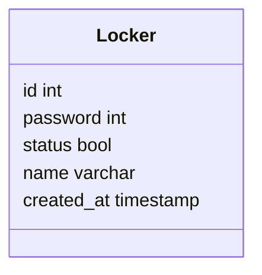

# 1. Langages utilisés
<div><ul>
python
</ul>
<ul>
Json
</ul><ul>
PHP
</ul><ul>
MySQL
</ul>
<ul>
CSS
</ul>
</div>

# 2.Front

# 3.Back
## 3.1 Base de données
L'idée du locker amène à la création d'une base de données. Nous en sommes arrivés à la conclusion qu'il était nécessaire d'obtenir toutes les informations du locker comme les identifiants ou les mots de passe.

Notre base de données ne contient qu'une seule table 'Locker' qui est la base même de notre API. Celle-ci vient reprendre toutes les informations nécessaires pour récupérer et renvoyer les informations au front.

Pour lancer les fichiers liés à la base de données il faut exécuter dans le terminal de commande :
php nomDuFichier

## 3.1 Index

On vient chercher les données de la base de données. <br>
Avec le $_GET['password'] on récupère le mot de passe pour venir le comparer à la base de données et ainsi vérifier s'il y a une donnée qui coïncide.<br>
La fonction htmlentities vient sécuriser la requête en empêchant les failles de sécurité HTML en bloquant toutes les balises HTML qui pourraient être rentrées dans le champ de mot de passe.<br>
Le query et le fetch_assoc viennent comparer les données contenues en base de données afin de pouvoir ouvrir le locker ou afficher un message d'erreur indiquant que le mot de passe n'est pas correct.<br> 
Le tout est situé dans un try catch, instruction définissant un message si une des instructions contenues à l'intérieur provoque une exception à la sortie. Le try catch sert à attraper les erreurs et à les afficher en cas de problème.<br>

## 3.2 Générateur de mot de passe


# 4.Script de contrôleur de moteur en Python, sur Rasberry PI + Script d'exécution en php. 

### Mise en place du projet


Pour commencer à faire tourner le loquet, il faut déjà le brancher correctement. Un cerveau moteur doit être branché de la manière suivante :
- Le fil "moins" sur un pin **ground**
- Le fil "plus" sur un pin d'alimentation **5V**
- Le fil "signal" sur un pin **GPIO**

:warning: Le Raspberry doit être redémarré après les branchements !

<br/>

### Script de mise en marche du cerveau moteur

Le fichier est dans le chemin suivant : */var/www/html/locker*
<br/>
```python
import time
import sys
from gpiozero import Servo
```
Nous avons besoin d'importer plusieurs librairies Python. 
```Time``` sert à utiliser des valeurs en secondes.
```Sys``` permet d'appeler le script depuis le terminal avec des paramètres donnés.
```Gpiozero``` est un outil pour manipuler les GPIO. 
```Servo``` est utilisé pour gérer la rotation d'un cerveau moteur. La rotation peut être effectué du minimum au maximum en passant par le point médian.
<br/>
```python
ports = [17,27]

myGPIO = int(sys.argv[1])
myState = int(sys.argv[2])

servo = Servo(myGPIO)
```
Les variables ```17``` et ```27``` correspondent aux numéros des ports GPIO utilisés pour les cerveaux moteurs.
```myGPIO``` et ```myState``` sont les variables qui stockent des données récupérées depuis l'API.
<br/>
```python
def close_lock():
	servo.max()
	time.sleep(0.5)
	
def open_lock():
	servo.min()
	time.sleep(0.5)
```
Voici les deux fonctions qui servent à **ouvrir** et **fermer** le loquet. 
:warning: Le loquet doit être qualibré manuellement afin que le ```min``` ou le ```max``` correspondent à la position **ouverte** ou **fermer**
<br/>

```python
if myGPIO in ports :
	
	if myState == 0:
		print("Locker fermé")
		close_lock()
		
	elif myState == 1:
		print("Locker ouvert")
		open_lock()
```
Maintenant on vérifie que les ports GPIO correspondent bien à un loquet existant puis on change l'état de **fermer** à **ouvert** ou de **ouvert** à **fermer**

<br/>

### Script PHP de lancement du script Python

<br/>

Afin de communiquer avec l'API, on a crée un fichier ```index.php```. Ce fichier permet d'exécuter le script de controle du moteur, sans passer par le terminal. 

Dans un premier temps, on initialise les variables.

```php
$output = null; //output original value
$result = null; //output original result
```
 <br/>

Ensuite, le programme récupère les paramètres dans la requête API et vérifie leur présence. 


```php
if(isset($_GET["command"])&& !empty($_GET["command"])){
    $commande = $_GET['commande'];
}else{
    $output["error"]["command"]= "the command is wrong or missing";
}

if(isset($_GET["port"])&& !empty($_GET["port"])){
    $port = $_GET['port'];
}else{
    $output["error"]["port"] = "the port is wrong or missing";
}
```
<br/>

Le programme exécute le script python avec les paramètres. Il renvoit aussi une réponse ```json``` qui contient les print du script python.

```php
exec("python3 script.py $commande $port ",$output); 

echo json_encode($output); // réponse json
```

# 5.Serveur

Le serveur est accessible grâce à un Linux Ubuntu sur lequel nous avons installé un serveur apache ainsi que PHP en version 8.1 et une version de MySQL afin de pouvoir faire tourner notre API dessus.
