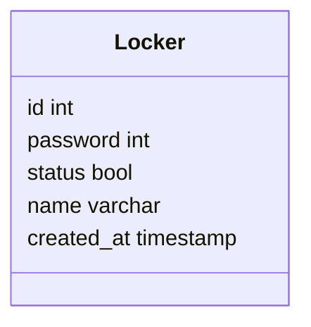

# 1. Langages utilisés

<ul>
python
</ul>
<ul>
Json
</ul><ul>
PHP
</ul><ul>
MySQL
</ul>
<ul>
CSS
</ul>

# 2.Front

# 3.Back
## 3.1 Base de données
L'idée du locker amène à la création d'une base de données. Nous en sommes arrivés à la conclusion qu'il était nécessaire d'obtenir toutes les informations du locker comme les identifiants ou les mots de passe.

Notre base de données ne contient qu'une seule table 'Locker' qui est la base même de notre API. Celle-ci vient reprendre toutes les informations nécessaires pour récupérer et renvoyer les informations au front.

Pour lancer les fichiers liés à la base de données il faut exécuter dans le terminal de commande :
php nomDuFichier

## 3.1 Index

On vient chercher les données de la base de données.  
Avec le $_GET['password'] on récupère le mot de passe pour venir le comparer à la base de données et ainsi vérifier s'il y a une donnée qui coïncide. 
La fonction htmlentities vient sécuriser la requête en empêchant les failles de sécurité HTML en bloquant toutes les balises HTML qui pourraient être rentrées dans le champ de mot de passe. 
Le query et le fetch_assoc viennent comparer les données contenues en base de données afin de pouvoir ouvrir le locker ou afficher un message d'erreur indiquant que le mot de passe n'est pas correct.  
Le tout est situé dans un try catch, instruction définissant un message si une des instructions contenues à l'intérieur provoque une exception à la sortie. Le try catch sert à attraper les erreurs et à les afficher en cas de problème. 

## 3.2 Générateur de mot de passe

# 4.Script/python

# 5.Serveur

Le serveur est accessible grâce à un Linux Ubuntu sur lequel nous avons installé un serveur apache ainsi que PHP en version 8.1 et une version de MySQL afin de pouvoir faire tourner notre API dessus.
